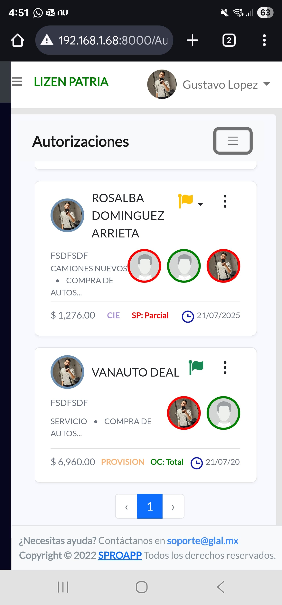

# 🌐 GLAL - Sistema integral para la gestión administrativa

GLAL es un sistema digital diseñado para transformar y optimizar los procesos administrativos de las organizaciones.  
Proporciona módulos de control presupuestal, seguimiento de gastos, pagos a proveedores y administración de órdenes de compra, todo en una plataforma centralizada y segura.

---

## 🚀 Características principales

- **Gestión de presupuestos**: Control y seguimiento en tiempo real de ingresos y egresos.  
- **Control de gastos**: Visualización clara de rubros, áreas y disponibilidad de recursos.  
- **Reportes y estadísticas**: Gráficas y reportes dinámicos para una toma de decisiones ágil.  
- **Pagos a proveedores**: Administración de facturas, estados de pago y flujo de caja.  
- **Órdenes de compra**: Flujo de autorizaciones jerárquicas para compras seguras y transparentes.  

---

## 📸 Capturas de pantalla

### Pantalla principal

### Módulo de Presupuesto

### Reportes y gráficas

### Pagos a proveedores

### Órdenes de compra

### Configuración de autorizaciones

### COnfiguracion de otras pantallas

---

## 🛠️ Tecnologías utilizadas

- **Backend**: PHP (Laravel)  
- **Frontend**: Blade, Bootstrap, JavaScript  
- **Base de datos**: MySQL  
- **Infraestructura**: Despliegue en servidor web (Linux/Apache)  

---

## 📌 Nota

Este repositorio es solo demostrativo para portafolio.  
Las capturas han sido editadas para proteger datos sensibles de clientes, usuarios y empresas.
